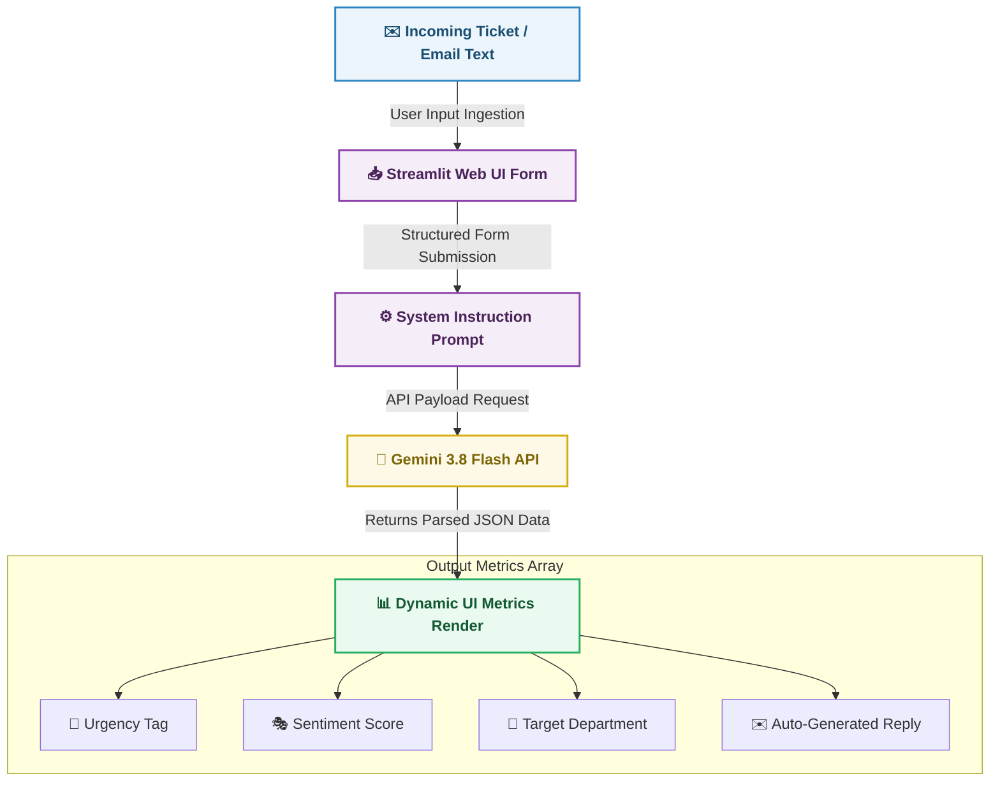

# 🤖 AI-Powered Customer Support Triage & Lead Routing Agent : Website Edition

A live, production-grade microservice designed to automate enterprise communication workflows. This tool analyzes incoming customer emails, reviews, or sales inquiries, extracts structured operational metadata, and auto-drafts highly contextualized executive responses in real-time.

🌍 **Live Demo:** (https://luke-frohling-ai-support-agent.streamlit.app/)

## 💼 Business Value Case
Manual support ticket triage costs businesses millions in lost productivity and slow customer response times. This solution addresses those structural bottlenecks by:
* **Reducing Response Latency:** Automatically flags urgent accounts or cancellation risks for immediate human intervention.
* **Smart Data Extraction:** Converts chaotic, unstructured text strings into reliable, parsable JSON data payloads.
* **Automated Scaling:** Routes requests directly to Billing, Tech Support, or Sales departments without human triage overhead.

## 🛠️ Tech Stack & Architecture
* **Frontend UI Framework:** Streamlit (Hosted on Streamlit Community Cloud)
* **AI Core Backend:** Google Gemini API SDK (`gemini-3.8-flash`)
* **Language:** Python 3.12
* **Data Format:** Structured JSON Output

## ➡ Flow

 

## 🚦 Cache Option (for this demo)  
Activate the "simulated" toggle option.

 

## 🧪 Test Run
* Give it something to work on. As an example:
  
*Hi, I love your app but my billing department just noticed we were charged twice for our enterprise subscription this month. Please fix this immediately or we will have to cancel our contract. Thanks, Luke from Amazon.*

 

## 🚀 Advanced Production Optimizations Implemented
During development and live deployment, several critical engineering guardrails were introduced to handle production constraints:

1. **System Prompt Instruction Framing:** Forced the core LLM to behave strictly as a data-extraction backend, ensuring reliable, programmatic formatting without conversational fluff.
2. **State Management & Form Isolation:** Wrapped the interface in explicit submission forms to control page re-renders, preventing aggressive script executions from spamming backend microservices.
3. **Resilient Recruiter Simulator Toggle:** Engineered a cached static mock-data fallback layer to guarantee uninterrupted frontend UI performance when external API daily quotas or billing rate limits are met.
4. **Secure Environment Variables Isolation:** Protected sensitive Google AI Studio access tokens natively using encrypted production secrets management arrays instead of hardcoding raw strings.
